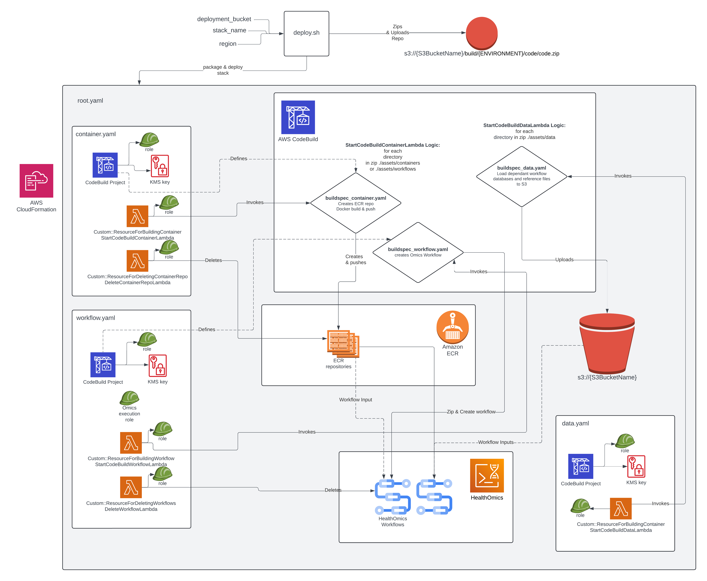

# Drug Discovery Workflows for AWS HealthOmics

## Description

A collection of AWS HealthOmics workflows to accelerate drug discovery.

## News

AWS HealthOmics Drug Discovery Workflows now supports the [ESM3](https://huggingface.co/EvolutionaryScale/esm3-sm-open-v1) model by [EvolutionaryScale](https://www.evolutionaryscale.ai/)! Please see the `README` file at `workflows/protein_annotation/` for more information.

## Deployment

For individual deployments, you also can navigate to the README in `assets/workflows/<workflow-name>`. The following is currently a WIP, but will be the recommended way shortly!

### Quick Start

1. Clone this repository to your local environment.
2. Authenticate into your AWS account of interest and `cd` into the project dir.
3. Run the following command, replacing the placeholders with the name of a S3 bucket,
desired stack name, and region:

```bash
./deploy.sh \
  -b "my-deployment-bucket" \
  -n "my-aho-ddw-stack" \
  -r "us-east-1"
```

The CloudFormation deployment should finish in about 3 minutes. It will take another 30 minutes to build the algorithm containers.

Once the deployment has finished, you can create a private workflow run using the Amazon HealthOmics console, CLI, or SDK. You may re-run the `./deploy.sh` script with the same arguments to update the CloudFormation stacks after code modifications to NextFlow scripts, Dockerfiles, or container build context directories are saved. This will trigger a rebuild and push of containers to ECR with the `latest` tag, and create new versions of the HealthOmics workflows.

### Data

Many of the workflows in this repository require additional model weights or reference data. Please refer to the README files for each workflow in the `workflows/` folder.

### Infrastructure Diagram

<!-- Not final form yet -->


## Development (WIP)

To add a new module, fork the repository. There are three main components:

* **Containers:** contains the required information/data to build Docker images for specific tasks
* **Modules:** common packages, such as MSA search/unpacking data that multiple algorithms may use
* **Workflows:** Specifc workflows, such as AlphaFold-Multimer that contain the `main.nf` script.

```txt
assets/containers/
├── alphafold
├── biolambda
└── ...
assets/modules/
├── alphafold2/
├── alphafold-multimer/
├── unpack.nf
└── ...
assets/workflows/
├── alphafold2/
├── alphafold-multimer/
└── ...
```

The `containers` folder contains Dockerfiles and supporting files to build docker containers. The deployment process will attempt to use every subfolder here as a Docker build context without any further configuration. Right now, there are two types of containers provided by default. "Framework" containers like "biolambda" and "transformers" provide general-purpose ML environments to run custom scripts (passed in during container build via the "scripts" folder). "Algorithm" containers like "alphafold", on the other hand, contain dependencies and scripts for spoecific models, in many cases lightly adapted from open source repositories. These are meant to be used as-is, without much customization.

Similarly, the `workflows` contains the HeathOmics workflow files (.wdl and .nf) and supporting files to create private workflows. The deployment process will attempt to deploy every subfolder here as a HealthOmics workflow deployment package without any further configuration. Just drop in your modules and deploy! To reference a private docker image in your workflow files, replace the uri with a {{MyContainer}} placeholder, where "MyContainer" is the name of your repository. For containers you define in the `modules/containers` folder, this will be the folder name. The deployment pipeline will automatically replace the placeholder with the correct ECR URI for your account and region. For example, if you want to use the "biolambda" container, use {{biolambda}}. You can also append an image tag, like {{biolambda:latest}}.

### Linting

You can lint this repositories NextFlow code using the AWS provided tool [awslabs/linter-rules-for-nextflow](https://github.com/awslabs/linter-rules-for-nextflow), which has been been integrated with `make`:

```bash
make lint
```

Also see [.github/workflows](./.github/workflows/) for other linting tools that have been setup as GitHub Actions workflows.

### Development Test Script

The `testrun.sh` script can be used to invoke NextFlow workflows in this repository, for development purposes, with the specified param json file. Be sure to create a file with your desired input params, for which the Omics exeution role has S3 access.

Prerequisites:
- S3 bucket with input data
- S3 bucket to store outputs, can be the same as the input bucket
- HealthOmics execution role with access to the buckets


`testparams/rfdiffusion.params.json`:
```sh
{
  "input_pdb": "s3://mybucket/rfdiffusion/6cm4.pdb"
}
```

Example run with full argument list:

```sh
./testrun.sh \
-w rfdiffusion \
-a 123456789012 \
-r us-east-1 \
-o "arn:aws:iam::123456789012:role/healthomics-dev-role" \
-b mybucket \
-p file://testparams/rfdiffusion.params.json
```

Or create an `.aws/env` file to simplify the arguments:
```sh
ACCOUNT_ID=123456789012
REGION=us-east-1
OMICS_EXECUTION_ROLE=arn:aws:iam::123456789012:role/healthomics-dev-role
OUTPUT_BUCKET=mybucket
```

and then:
```sh
./testrun.sh -w rfdiffusion -p testparams/rfdiffusion.params.json
```
