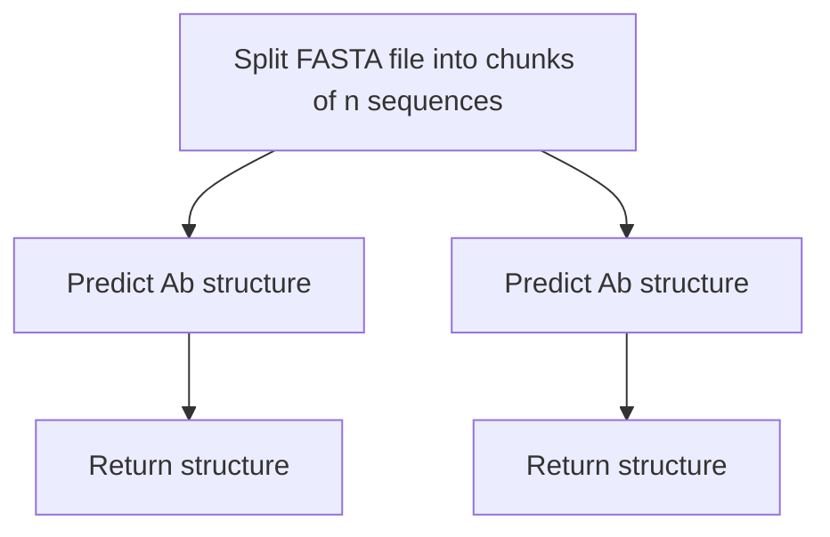

# Predict Antibody Structure with ABodyBuilder3

## Summary

Predict antibody structures using the [ABodyBuilder3](https://github.com/Exscientia/abodybuilder3) model from Exscientia.

## Workflow

```mermaid

flowchart TD
  A[Split FASTA file into chunks of n sequences] --> B[Predict Ab structure] --> C[Return structure]
  A --> D[Predict Ab structure] --> E[Return structure]

```
