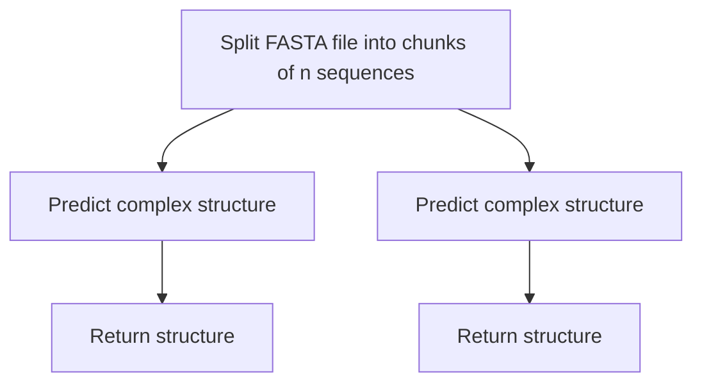

# Predict Biomolecular Complex Structures with Chai-1

## Summary

Predict the structure of biomolecule complexes (Proteins, amino acids, and/or ligands) using the [Chai-1](https://github.com/chaidiscovery/chai-lab) model from Chai Discovery.

## Workflow

