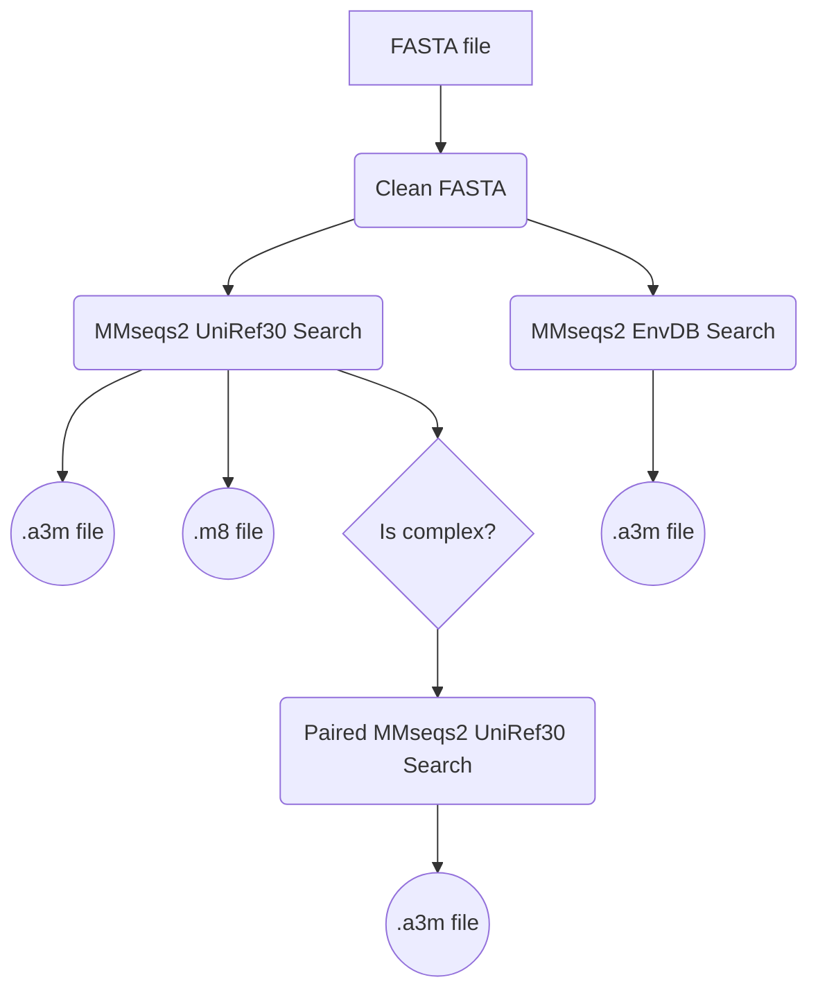

# Colabfold workflow for MSA generation using MMseqs2

## Summary

MSA generation workflow using process described at https://github.com/sokrypton/ColabFold/blob/main/colabfold_search.sh.

## Workflow

