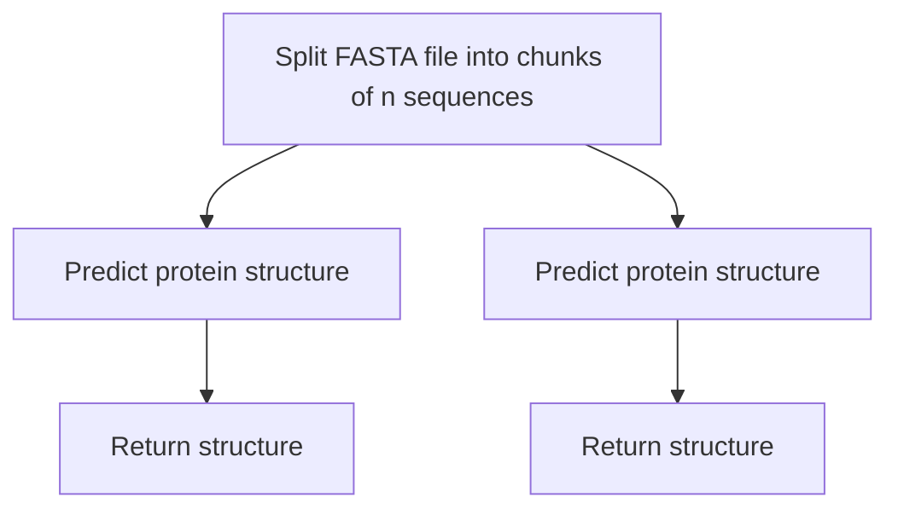

# De Novo Nanobody Design

## Summary

Generate de novo nanobody candidates against a given target protein structure and epitope.

## Workflow

```mermaid

flowchart TD
  A[Split FASTA file into chunks of n sequences] --> B[Predict protein structure] --> C[Return structure]
  A --> D[Predict protein structure] --> E[Return structure]

```
