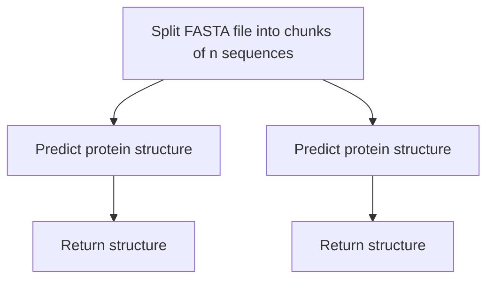

# Predict Protein Structure with ESMFold

## Summary

Predict protein structures using ESMFold for one or more amino acid sequences.

## Workflow

```mermaid

flowchart TD
  A[Split FASTA file into chunks of n sequences] --> B[Predict protein structure] --> C[Return structure]
  A --> D[Predict protein structure] --> E[Return structure]

```
