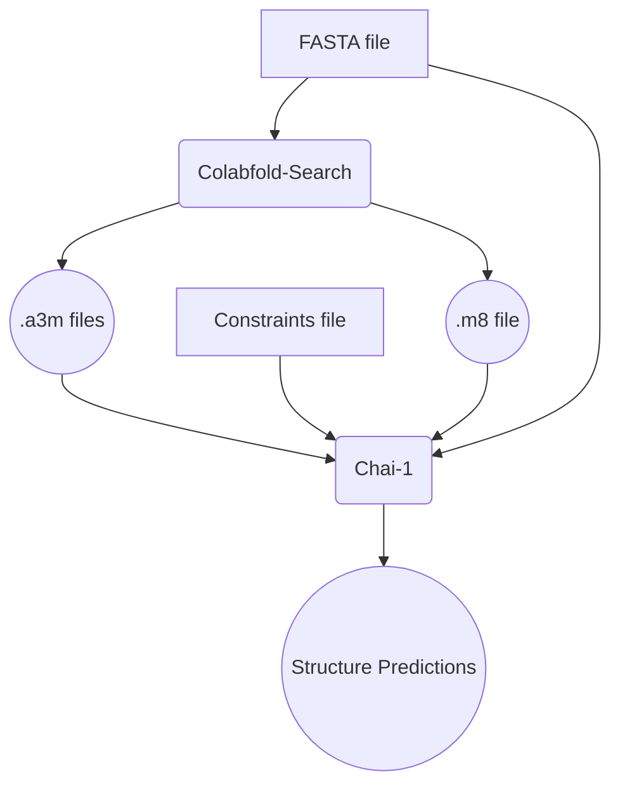

# Predict Protein Complex Structures

## Summary

Predict the structure of biomolecular complexes, including proteins, DNA, RNA, and small molecules.

## Workflow



## Example

Replace <WORKFLOW_ID>, <IAM_ROLE>, <RUN_NAME>, and <DEPLOYMENT_BUCKET_NAME> with the correct values for your deployment.

```bash
aws omics start-run \
  --cli-input-json \
  '{
    "workflowId": <WORKFLOW_ID>,
    "workflowType": "PRIVATE",
    "roleArn": <IAM_ROLE>,
    "name": <RUN_NAME>,
    "parameters": {
      "query": "s3://<DEPLOYMENT_BUCKET_NAME>/ref-data/chai/8cyo.fasta",
      "constraints_path": "s3://<DEPLOYMENT_BUCKET_NAME>/ref-data/chai/8cyo.restraints",
      "use_msa": 1,
      "use_templates": 1
    },
    "storageType": "DYNAMIC",
    "outputUri": "s3://<DEPLOYMENT_BUCKET_NAME>/tests/outputs/"
}'
```
