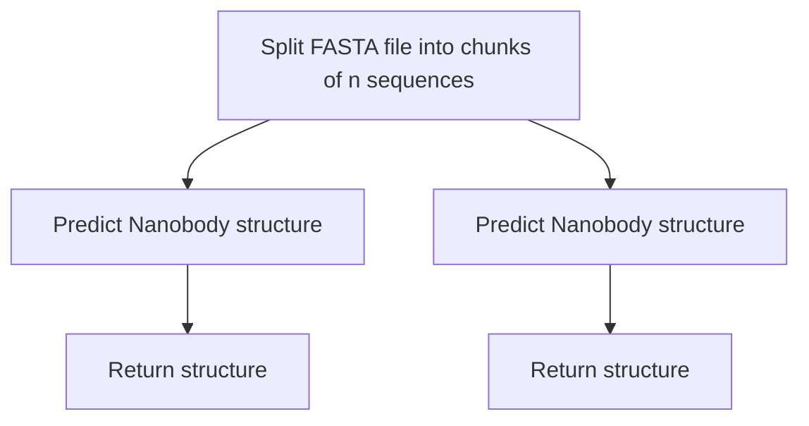

# Predict Antibody Structure with ABodyBuilder3

## Summary

Predict antibody structures using the [NanoBodyBuilder](https://github.com/oxpig/ImmuneBuilder) model from the Oxford Protein Informatics Group.

## Workflow

