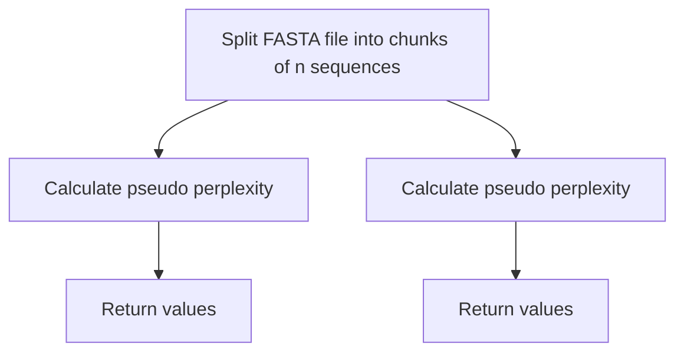

# Calculate Pseudo Perplexity with AMPLIFY

## Summary

Calculates the pseudo perplexity of one or more protein sequences using the AMPLIFY pLM.

## Workflow

```mermaid

flowchart TD
  A[Split FASTA file into chunks of n sequences] --> B[Calculate pseudo perplexity] --> C[Return values]
  A --> D[Calculate pseudo perplexity] --> E[Return values]

```
