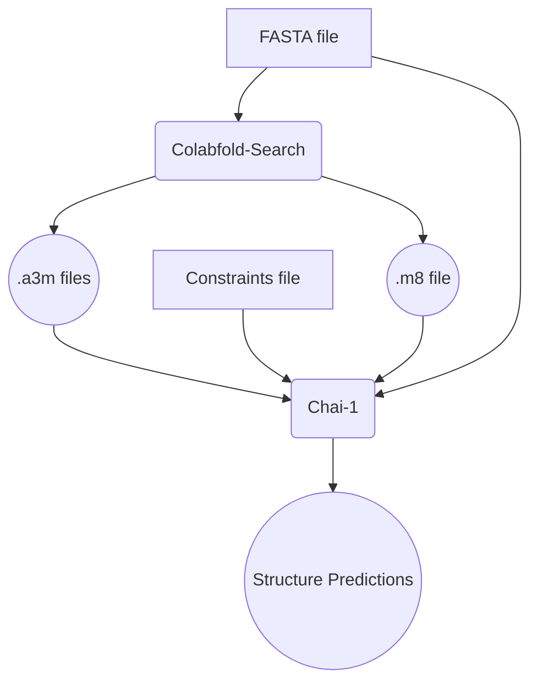

# Predict Protein Complex Structures

## Summary

Predict the structure of biomolecular complexes, including proteins, DNA, RNA, and small molecules.

## Workflow

```mermaid

flowchart TD
    A[FASTA file] --> B(Colabfold-Search)
    B --> B1((.a3m files))
    B --> B2((.m8 file))
    B1 --> C(Chai-1)
    D[Constraints file] --> C
    B2 --> C
    A --> C
    C --> C1((Structure Predictions))

```
