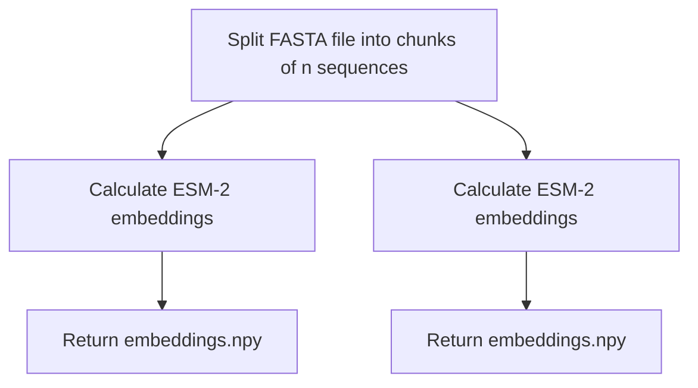

# ESM-2 Embeddings Generation Workflow

## Summary

Generate ESM-2 vector embeddings for one or more protein amino acid sequences.

## Workflow

```mermaid

flowchart TD
  A[Split FASTA file into chunks of n sequences] --> B[Calculate ESM-2 embeddings] --> C[Return embeddings.npy]
  A --> D[Calculate ESM-2 embeddings] --> E[Return embeddings.npy]

```
