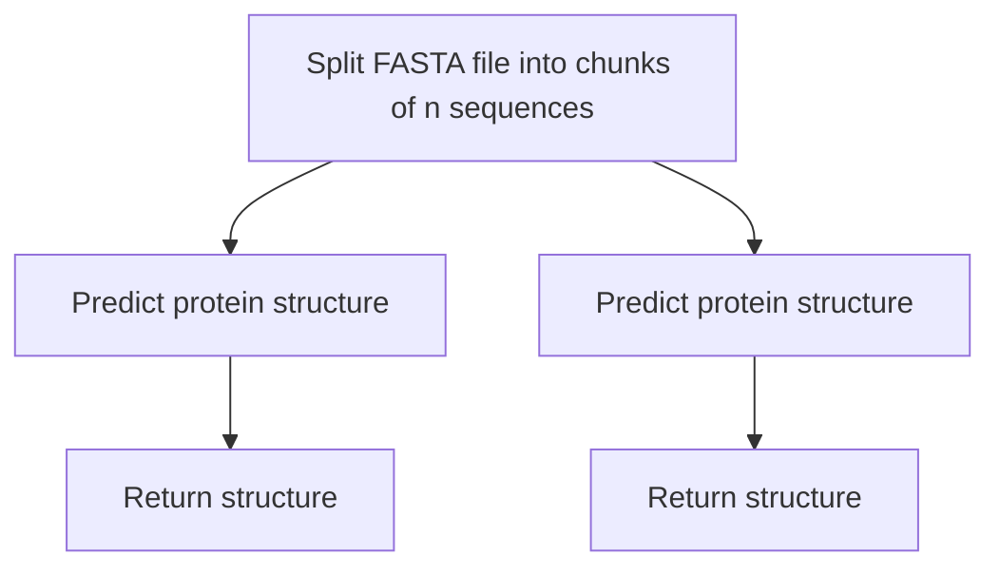

# ESMFold Workflow

## Summary

Predict protein structures using ESMFold for one or more amino acid sequences.

## Data

Run the following commands to download the necessary reference data into your accout.

`bash download.sh `

## Workflow

